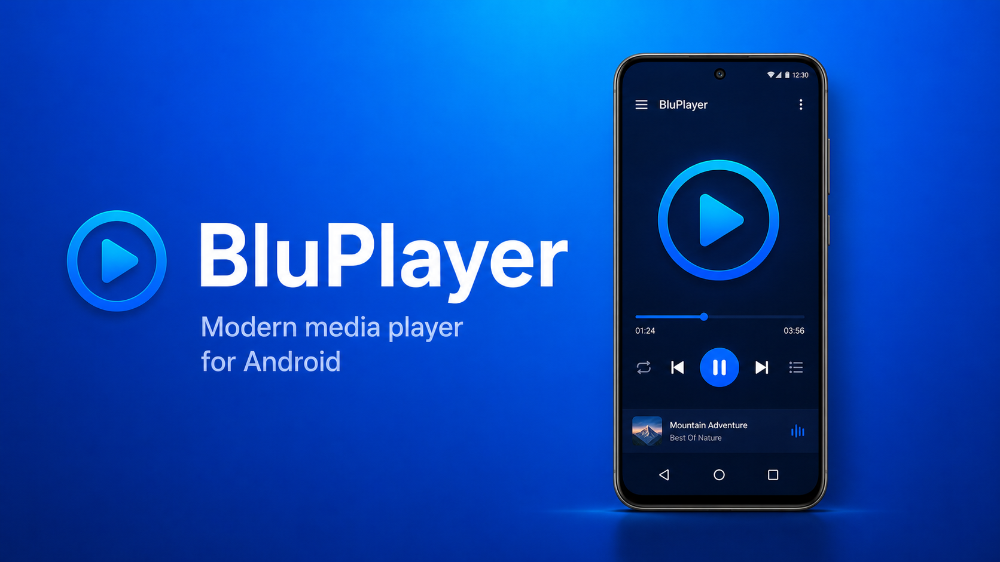
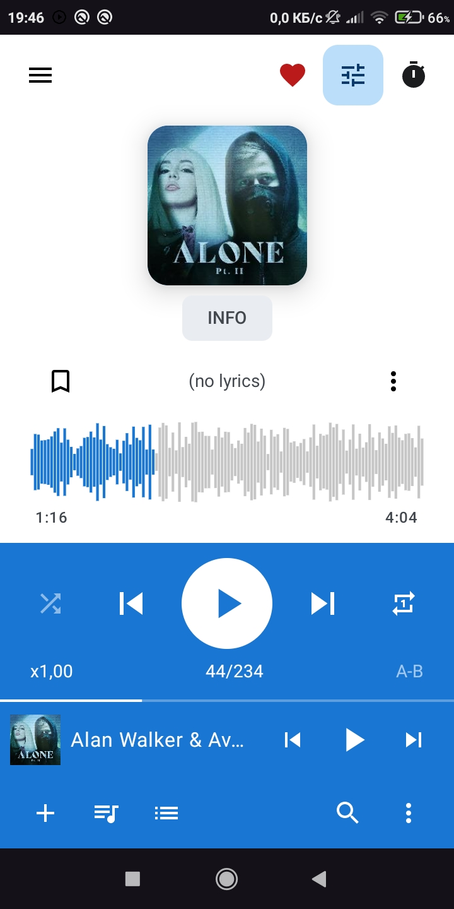
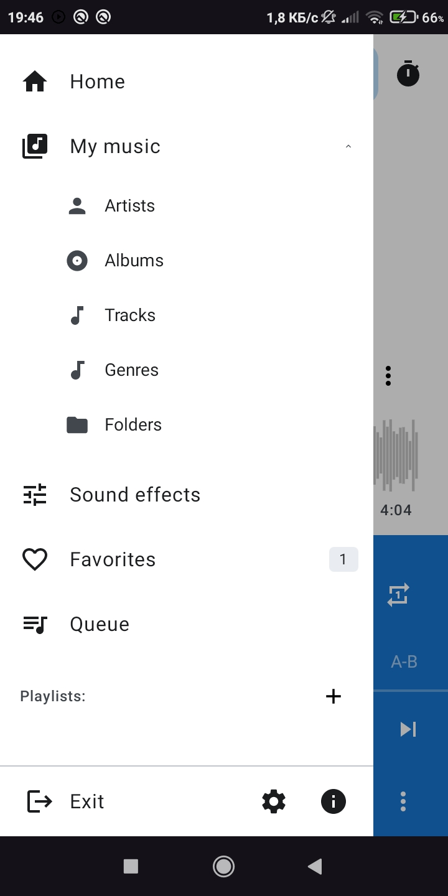
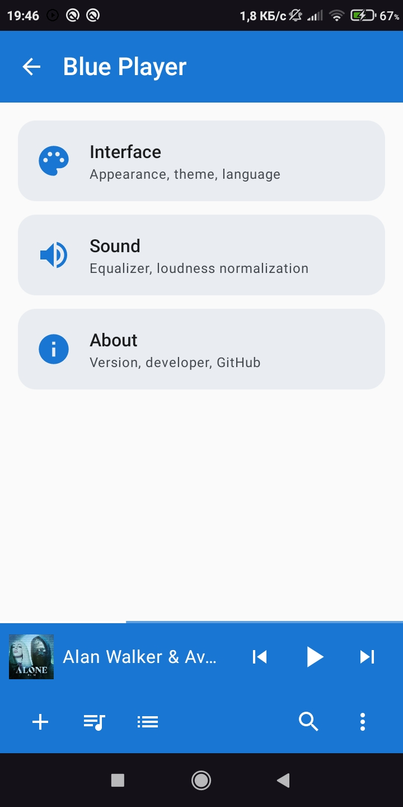
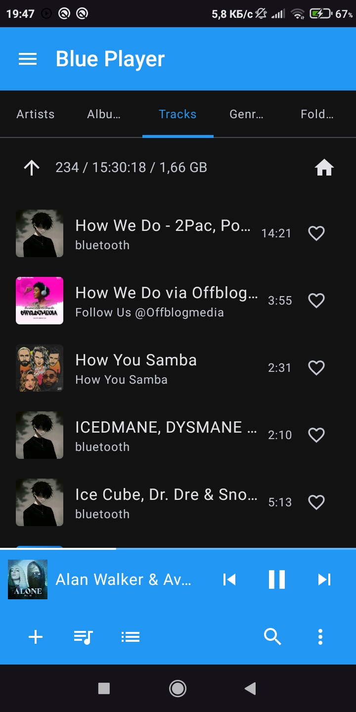
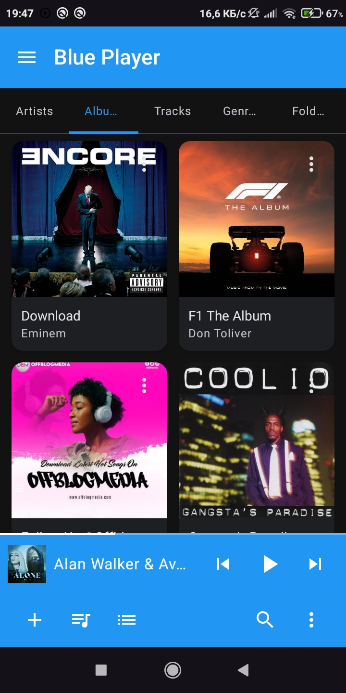
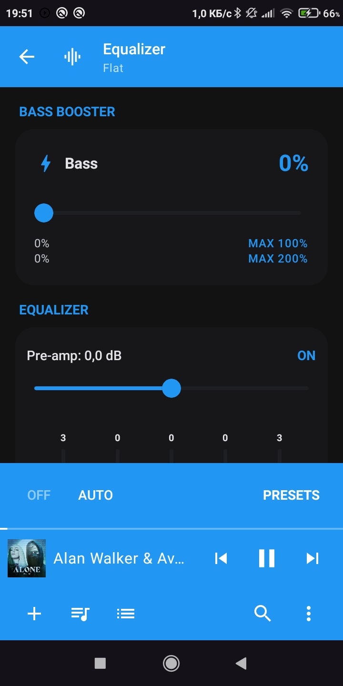

<p align="center">
  
</p>

<p align="center">
  
</p>

<h1 align="center">BluePlayer</h1>

<p align="center">
  A modern music player for Android with a native C++ bass engine,<br>
  Material 3 design and full background playback.
</p>

<p align="center">
  
  
  
  
  
  
</p>

---

## ✨ Features

### 🎧 Playback
- Background playback via an AndroidX Media3 `MediaSessionService` with notification controls
- Queue with shuffle and repeat modes (off / all / one)
- Playback speed control: 0.75x – 2.0x
- A–B loop repeat
- Sleep timer: by duration, end of track or end of queue, with an optional "wait for the current track to finish" mode
- Bookmarks: save a position inside a track and jump back to it later
- Waveform seek bar with drag scrubbing and haptic feedback
- Last session is restored at the saved position after restart

### 🎛 Audio engine
- Graphic equalizer built on `android.media.audiofx` with 15 built-in presets (Flat, Deep Bass, Bass Boost, Treble, Vocal, Rock, Pop, Jazz, Classical, Dance, Hip-Hop, Electronic, Metal, Acoustic, Loudness) plus custom curves
- Pre-amp with automatic volume compensation
- **Native C++ bass engine (NDK / CMake):** low-shelf biquad filter with a cascade mode (24 dB/oct) and a `tanh` soft-clip limiter — loud, clean bass without clipping
- Virtualizer (surround) and reverb presets (rooms, halls, plate)
- Loudness normalization toggle

### 📚 Library
- Browse music by tracks, albums, artists, genres and folders
- Home screen with switchable library sections
- Fast search across tracks, albums and artists with grouped results
- Playlists: create, rename, delete, add tracks from any screen
- Favorites
- Per-track actions: file info, share, go to album, add to playlist

### 🖼 Artwork
- Embedded cover art from local files
- Automatic online cover lookup (iTunes Search API) with disk caching when a file has no embedded art

### 🎨 Interface
- Material 3 design with light / dark / system theme modes
- Three interface languages: English, Russian, Turkmen
- Navigation drawer, mini-player bar, full-screen player
- Launcher app shortcuts (long-press the icon): Settings, My Music, Playlists
- Splash screen and animated UI

---

## 📱 Screenshots

|:---:|:---:|:---:|
|  |  |  |
|  |  |  |

---

## 🏗 Architecture

BluePlayer is a multi-module project:

| Module | Responsibility |
|---|---|
| `app` | Entry point, `MainActivity`, `MusicPlaybackService`, DI container, navigation root |
| `core:domain` | Domain models, repository contracts, in-app localization (EN / RU / TK) |
| `core:data` | Repository implementations: MediaStore scanning, playlists, favorites, bookmarks |
| `core:database` | Room database |
| `core:player` | Media3 playback engine, equalizer engine, native C++ DSP (NDK / CMake) |
| `feature:*` | Screens: home/library, albums, artists, genres, folders, playlists, favorites, search, queue, settings + equalizer, now playing |
| `ui:theme`, `ui:components` | Design system: colors, typography, shared Compose components |

Feature modules never depend on each other — shared code lives in `core` and `ui`.

---

## 🧰 Tech stack

| Layer | Technology |
|---|---|
| Language | Kotlin 2.4.0 |
| UI | Jetpack Compose (BOM 2024.06.00), Material 3, Navigation Compose 2.8.0 |
| Playback | AndroidX Media3 1.4.1 (ExoPlayer, MediaSession, MediaSessionService) |
| Native audio | C++17, CMake 3.22.1, JNI (biquad low-shelf + soft-clip DSP) |
| Database | Room |
| Async | Kotlin Coroutines / Flow, Lifecycle 2.8.6 |
| Images | Coil 2.7.0, Glide 4.16.0 |
| Build | AGP 8.5.2, Gradle Kotlin DSL, JDK 17 |
| Platforms | minSdk 24, targetSdk / compileSdk 34 |

---

## 🚀 Getting started

### Requirements
- Android Studio (Ladybug or newer)
- JDK 17
- Android SDK Platform 34
- NDK (Side by side) and CMake — install via **SDK Manager → SDK Tools**
- A device or emulator with API 24+

### Run from source
```bash
git clone https://github.com/Shapak-Apps/BluePlayer.git
cd BluePlayer
```
1. Open the project in Android Studio and wait for Gradle sync (the first sync builds the native C++ library, it can take a few minutes).
2. Select the `app` configuration and a target device.
3. Press **Run**.
4. Grant the audio permission when asked.

Or from the command line:
```bash
./gradlew assembleDebug
```

### Release build
Release signing is optional. To sign with your own key, create `keystore.properties` in the project root (this file is git-ignored):
```properties
storeFile=../your-key.jks
storePassword=*****
keyAlias=*****
keyPassword=*****
```
Then:
```bash
./gradlew assembleRelease
```
Without `keystore.properties` the release build falls back to debug signing.

---

## 🌍 Localization

All user-facing strings live in `core:domain` (`Strings`) and ship in three languages:
English, Russian and Turkmen. The language can be switched at runtime in Settings → Interface.

---

## 🤝 Contributing

Contributions are welcome! Please read [CONTRIBUTING.md](CONTRIBUTING.md) before opening an issue or a pull request.

---

## 📄 License

```
Copyright 2026 Aýnazar Sylyýew

Licensed under the Apache License, Version 2.0 (the "License");
you may not use this file except in compliance with the License.
You may obtain a copy of the License at

    http://www.apache.org/licenses/LICENSE-2.0

Unless required by applicable law or agreed to in writing, software
distributed under the License is distributed on an "AS IS" BASIS,
WITHOUT WARRANTIES OR CONDITIONS OF ANY KIND, either express or implied.
See the License for the specific language governing permissions and
limitations under the License.
```